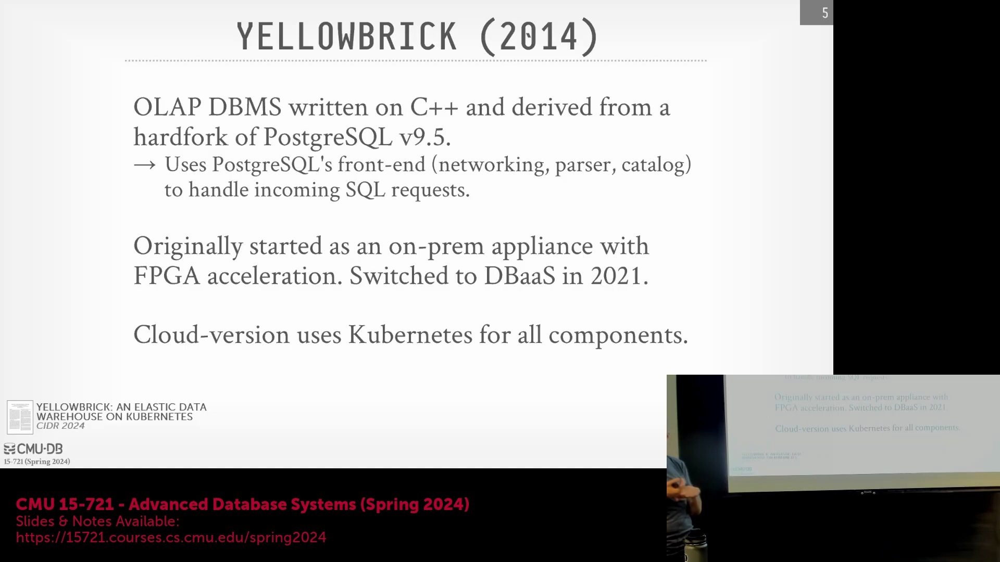
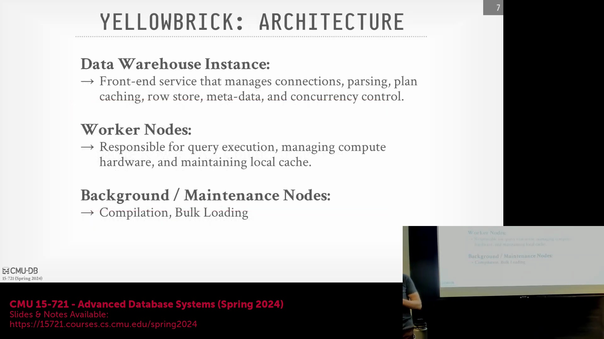
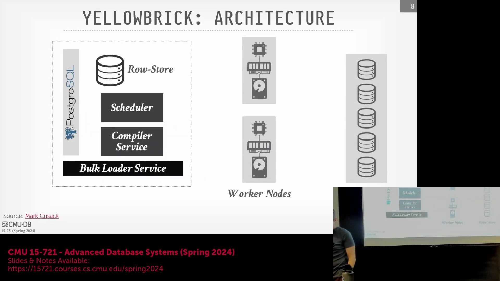
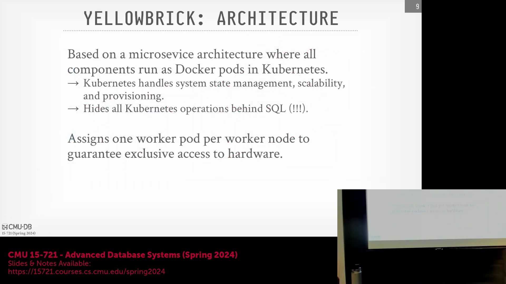
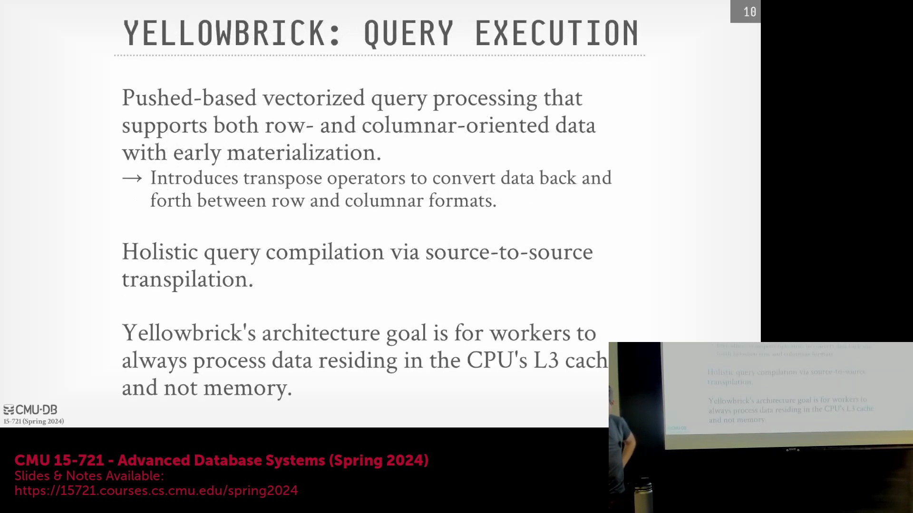

## 课程介绍与 Yellowbrick 概述

欢迎来到卡内基梅隆大学的高级数据库系统课程。今天的讲座将聚焦于 Yellowbrick，这是一个极具创新性且相对低调的数据库系统。该公司的技术方法不断突破工程边界，甚至实现了编写自定义 PCIe 驱动程序(PCIe Driver)等非常规解决方案。这为理解底层系统优化的极限，以及重新审视传统数据库工程的约束条件，提供了绝佳的案例研究。

## 课程通知：期末展示与考试

在深入技术细节之前，先发布几项重要的期末课程通知。期末项目展示定于下周四上午 9 点在本教室进行。请同学们填写已发布的早餐偏好问卷(Breakfast Preference Survey)，并查阅课程网站了解交付物的具体要求。每次展示限时 10 分钟，整体氛围将保持轻松。期末考试试卷将于周三在课堂上发放，截止日期与展示日相同，请以 PDF 格式提交。需要注意的是，本次考试为课后作答考试(Take-Home Exam)，重点考察对核心概念的内化及其在新场景中的应用能力，而非对课程内容的死记硬背(Rote Memorization)。

## 历史背景与数据库中的硬件加速
回顾上节课的内容，DuckDB 依然是一个极具代表性的单节点在线分析处理(OLAP)系统，但其云端版本 MotherDuck 似乎更侧重于垂直扩展(Vertical Scaling)，而非水平分片(Horizontal Sharding)。转向专用硬件领域，数据库利用图形处理器(GPU)和现场可编程门阵列(FPGA)等硬件加速器的历史源远流长，例如亚马逊 Redshift 就采用了定制的 Aqua 芯片。早在 20 世纪 70 年代和 80 年代，厂商们就构建了定制化的数据库一体机(Database Appliance)，以加速查询处理和网络通信。然而，中央处理器(CPU)（如 Intel 和 Motorola 产品）快速的迭代周期往往迅速削弱了这些定制芯片的性能优势，导致数据库专用硬件的研发逐渐式微。

## Yellowbrick 的一体机起源与 FPGA 集成
现代方案通常采用商用加速器或预配置的硬件一体机，例如 Oracle Exadata，这些设备针对特定工作负载对商用现成组件(COTS)进行了深度调优。Yellowbrick 最初正是沿用了这种一体机架构。其物理节点采用标准的固态硬盘(SSD)和中央处理器(CPU)，但集成了现场可编程门阵列(FPGA)加速器，用于卸载布隆过滤器(Bloom Filter)哈希计算、磁盘数据解压缩以及行存储转列存储(Row-to-Column Conversion)等计算密集型任务。Yellowbrick 近期工程实践及相关研究论文的核心动机，是成功将这套高度优化、硬件加速的系统从本地一体机迁移至云环境，同时完整保留其底层的性能优势。

## 底层系统优化与工程风险
Yellowbrick 成立于 2014 年，其云版本于 2020 至 2021 年间正式发布。该系统架构因大量非常规的底层优化，一经推出便常被与 ClickHouse 相提并论。Yellowbrick 实现了内核旁路(Kernel Bypass)技术并开发了自定义设备驱动程序(Custom Device Driver)，这对初创公司而言工程风险极高，但最终取得了成功。尽管微软等大型云提供商已利用网卡(Network Interface Card, NIC)上的 FPGA 进行数据包过滤(Packet Filtering)，但目前尚不清楚其他大型厂商在系统级调优(System-level Tuning)的深度上能否与 Yellowbrick 匹敌。团队勇于攻克此类复杂的基础设施工程挑战，使其在现代数据库领域中独树一帜。

## 云架构与 Kubernetes 部署

Yellowbrick 是一个在线分析处理(OLAP)系统，最初采用无共享架构(Shared-Nothing Architecture)，但在云端转型为共享磁盘架构(Shared-Disk Architecture)，并采用了类似 Snowflake 的客户端缓存(Client-Side Caching)机制。其核心代码库基于 PostgreSQL 9.5 分支开发，并全面采用 C++ 编写。系统保留了 PostgreSQL 的前端模块，用于处理 ODBC/JDBC 网络协议、SQL 解析(SQL Parsing)和目录管理(Catalog Management)；但在将查询计划交由专用编译器处理前，会注入自定义的优化阶段(Optimization Passes)。至关重要的是，其云部署高度依赖 Kubernetes 容器编排平台，所有组件均作为容器化服务(Containerized Services)运行。尽管部署于容器化环境中，Yellowbrick 依然保持着对底层硬件的深度控制能力，这正是支撑前述复杂优化的关键所在。本次讲座的剩余部分将专门聚焦于该云架构。

---

## 高层系统架构与核心特性

Yellowbrick 的云架构基于计算与存储分离(Disaggregated Compute and Storage)的共享磁盘(Shared-Disk)模型构建。该系统采用推送式(Push-Based)向量化查询处理，并高度依赖 LLVM 进行代码生成(Code Generation)，将查询计划动态编译为可执行的 C++ 代码。它具备类似 Snowflake 的客户端缓存(Client-Side Caching)功能，以及为优化数据导入而设计的行列混合存储(Hybrid Row-Column Storage)引擎。新写入的数据最初以行式格式(Row Format)处理，随后由后台进程将其重组为 PAX (Partition Attributes Across) 列式存储格式。该引擎支持排序合并连接(Sort-Merge Join)、哈希连接(Hash Join)和嵌套循环连接(Nested Loop Join)。尽管基于 PostgreSQL 9.5 分支构建，但该系统通过自定义优化阶段(Optimization Passes)替代了标准查询执行器，并利用深度的内核级系统工程优化来提升性能。

## 前端服务与元数据管理

系统的前端由一个集中式实例管理，作为工作节点(Worker Nodes)与辅助服务的主要控制平面(Control Plane)。该层保留了 PostgreSQL 前端模块，负责处理客户端连接、SQL 解析(SQL Parsing)、查询计划生成(Query Planning)与优化(Query Optimization)。同时，它沿用 PostgreSQL 的多版本并发控制(Multiversion Concurrency Control, MVCC)机制来管理事务隔离级别。元数据与数据分布映射通过 PostgreSQL 系统目录(System Catalog)进行维护；为避免频繁查询目录带来的性能开销，Yellowbrick 对元数据实施了积极缓存策略(Aggressive Caching Strategy)。

## 工作节点、调度与共享磁盘缓存模型

查询计划从 PostgreSQL 前端传递至集中式调度器(Centralized Scheduler)与编译服务(Compilation Service)。调度器以 100 毫秒为周期向轻量级工作节点分发任务(Task Dispatching)，以保持紧密的执行同步。工作节点本质上是轻量级的执行容器，负责运行已编译的代码、管理节点间的数据移动(Data Shuffling)，并维护本地 NVMe 缓存(NVMe Cache)。当发生缓存未命中时，工作节点会从云对象存储(Cloud Object Storage，如 Amazon S3)中拉取数据块，并采用近似最近最少使用(Approximate LRU) 淘汰策略(Eviction Policy)更新缓存。尽管该系统最初源于本地部署的无共享架构(Shared-Nothing Architecture)，但其云版本目前已演进为共享磁盘架构(Shared-Disk Architecture)。写回缓存(Write-Back Cache)负责将脏数据同步至对象存储；而对于中间查询产生的溢出数据(Spill Data)，系统则通过背压机制(Backpressure Mechanism)将其暂存于本地 NVMe 驱动器，而非直接回写至云端。

## Kubernetes 编排与硬件控制

Yellowbrick 的基础设施全面采用容器化(Containerization)技术，并通过 Kubernetes 进行统一编排(Orchestration)。所有核心组件均以长期运行(Long-Running)的微服务形式部署，由 Kubernetes 负责状态管理(State Management)、节点配置(Node Provisioning)及自动故障转移(Automatic Failover)。为简化运维操作，复杂的 Kubernetes 与 Helm 图表(Helm Charts)配置被封装在 `CREATE CLUSTER` 或 `CREATE INSTANCE` 等标准 SQL 命令之后，用户可直接通过 SQL 进行集群管理。值得注意的是，该系统在工作节点 Pod 与物理服务器(Physical Node)之间强制实施严格的一对一映射(Strict One-to-One Mapping)。每个 Pod 独占底层硬件资源并采用直接内存分配(Direct Memory Allocation)，有效避免了多 Pod 共享单节点时可能引发的启动延迟与资源争用(Resource Contention)。在系统内部，节点间的数据移动(Data Movement)与通信均依赖自定义设备驱动程序(Custom Device Drivers)与专有网络协议(Proprietary Protocol)，而外部客户端连接则继续兼容标准的 PostgreSQL ODBC/JDBC 线路协议(Wire Protocol)。

## 执行引擎与向量化至行式的转换

执行引擎采用推送式执行模型(Push-Based Execution Model)，专门针对列式数据结构(Columnar Data Structures)的向量化处理(Vectorized Processing)进行了深度优化。尽管数据扫描(Data Scanning)与初始过滤(Initial Filtering)在列式格式下能够高效执行，但系统会在处理复杂操作时动态切换数据表示形式。当数据流入连接(Join)等操作时，专用的“转置算子”(Transpose Operator)会将向量化的列式数据批次(Columnar Batches)实时转换为行式格式(Row Format)。这种提前物化策略(Eager Materialization)使 Yellowbrick 能够同时兼顾行列两种存储布局(Storage Layout)的优势，从而显著优化内存访问模式(Memory Access Patterns)并提升连接操作的执行效率。

---

## 转置算子与 L3 缓存优化

Yellowbrick 在查询计划中策略性地注入了转置算子(Transpose Operator)，以便在执行哈希连接(Hash Join)或跨节点数据传输前，将列式数据转换为行式格式(Row Format)。该设计源于一种激进的优化理念，旨在最大化数据在中央处理器三级缓存(CPU L3 Cache)中的驻留率(Cache Residency)。通过将数据切分为较小的行数据块(Row Blocks)，系统确保处理单个元组(Tuple)所需的所有属性列都能完整驻留于 L3 缓存中。这一机制大幅降低了缓存未命中率(Cache Miss Rate)，实现了高效低延迟的数据处理，从而与那些仅依赖主内存(Main Memory)驻留的传统系统显著区分开来。

## 并行查询编译与编译器缓存

系统采用专用的独立编译服务(Compilation Service)执行全局查询编译，利用源到源转换(Source-to-Source Translation)技术将查询计划直接翻译为 C++ 代码。为突破 LLVM 单线程逐文件编译的性能瓶颈，Yellowbrick 主动将查询计划拆分为多个更小、相互独立的代码片段(Code Snippets)。这些代码片段随后在多线程环境下并发编译，最终通过动态链接(Dynamic Linking)重新组合。此外，编译服务内置了缓存层(Compiler Cache Layer)，只要运行时环境版本、硬件依赖(Hardware Dependencies)与查询结构(Query Structure)保持一致，系统即可缓存并复用已编译的二进制文件(Binary Artifacts)，从而大幅降低重复或相似查询的编译开销(Compilation Overhead)。

## 查询优化器扩展与托管统计信息

Yellowbrick 基于 PostgreSQL 的分层优化器(Hierarchical Optimizer)构建，并注入了专为该架构定制的代价模型扩展(Cost Model Extensions)与优化阶段(Optimization Passes)。系统利用区域映射(Zone Maps)进行激进的文件级数据剪枝(Data Pruning)，并维护详尽的元数据(Metadata)，包括列直方图(Histograms)、高频值(Heavy Hitters)列表以及 HyperLogLog 概率数据结构(HyperLogLog Sketches)。与开放式的湖仓一体(Lakehouse)架构不同，Yellowbrick 要求所有数据必须批量导入(Ingest)至其托管的存储环境中，而非直接查询外部的 Amazon S3 文件。这种受控的数据摄入(Data Ingestion)机制使系统能够执行深度的单节点 `ANALYZE` 统计信息收集操作，从而获取高精度的表级与列级统计信息(Table/Column Statistics)。尽管系统不采用运行时自适应查询执行(Runtime Adaptive Query Execution)，但开发团队会针对特定客户场景，偶尔部署硬编码的优化器规则(Hard-coded Optimizer Rules)，以规避 PostgreSQL 原生优化器的局限性，防止生成次优执行计划(Suboptimal Execution Plans)。

## 专有存储格式与后台合并压缩

尽管部署于共享磁盘(Shared-Disk)的云基础设施之上，Yellowbrick 仍对云对象存储(Cloud Object Storage)中的专有存储格式(Proprietary Storage Format)实施严格管控。数据文件被组织为约 100 MB 的段(Segments)，并进一步划分为 2 MB 的数据块(Data Blocks)。该格式支持用户自定义的分区键(Partition Keys)，并维护文件级的局部排序属性(Local Sort Properties)。尽管系统支持从 Parquet 文件批量导入数据，但对数据模式(Schema)实施严格限制，暂不支持嵌套 JSON 展开(Nested JSON Flattening)及复杂数据类型(Complex Data Types)。新插入的数据首先写入一个完全替换原生 PostgreSQL 实现的高性能自定义行式存储(Custom Row Store)中。随后，后台维护进程(Background Maintenance Processes)会持续从该行存中读取数据，执行转置与格式转换，最终将合并压缩(Compacted and Compressed)后的列式文件直接持久化至云存储层。

---

## 原生事务更新与后台合并压缩

与现代数据生态系统中通常依赖 Apache Iceberg、Hudi 或 Delta Lake 等开放表格式(Open Table Formats)处理数据更新的做法不同，Yellowbrick 在其列式存储(Columnar Storage)中原生支持事务性的插入、更新和删除(Transactional Inserts, Updates, and Deletes)操作。系统维护精确的事务日志(Transaction Logs)，用于追踪底层数据文件的变更，使查询引擎在读取时能够高效识别并跳过已失效或已更新的元组(Tuples)。为维持查询性能，后台维护进程(Background Maintenance Processes)会定期执行合并压缩(Compaction)流程，将多个变更文件进行合并，清理历史版本数据，并将活跃数据集(Active Datasets)重新整合为优化的列式数据段(Columnar Segments)，最终持久化至云对象存储中。

## 用于分布式文件分配的 Rendezvous 哈希算法

为将数据文件合理分配至工作节点(Worker Nodes)以填充本地缓存，Yellowbrick 采用了 Rendezvous 哈希算法(Rendezvous Hashing，亦称最高随机权重哈希)，而非 Snowflake 等系统中广泛使用的一致性哈希环(Consistent Hash Ring)拓扑。该算法以确定性(Deterministic)方式运行：将文件标识符(File ID)与每个工作节点的节点 ID 拼接，对组合字符串执行哈希运算(Hashing)，并生成按优先级排序的节点列表。随后，文件将被分配给计算结果哈希值最高的工作节点。该方法无需依赖集中式路由表(Centralized Routing Table)或全局状态同步(Global State Synchronization)，因为集群内每个节点均可基于共享的哈希函数(Shared Hash Function)独立计算出完全一致的文件映射关系(File Mapping)。

当集群拓扑(Cluster Topology)因弹性扩缩容(Elastic Scaling)或节点故障发生改变时，Rendezvous 哈希算法能确保仅有极小部分文件需要重新分配(Reassignment)，从而有效规避了传统取模哈希(Modulo Hashing)导致的大规模数据重分布(Data Rebalancing)开销。尽管该算法单次查找的时间复杂度(Time Complexity)为 $O(n)$（一致性哈希通常为 $O(\log n)$），但在节点变动相对低频的数据库稳定运行环境中，其计算开销微不足道。此外，该算法的工程实现也更为简洁。通过动态调整节点权重(Node Weights)或为高配置机器分配多个虚拟节点(Virtual Nodes)，系统可轻松实现异构硬件环境下的负载均衡(Load Balancing)，从而确保成千上万个约 100 MB 的数据文件在集群中均匀分布。

## 架构融合与容器化背景

Yellowbrick 的云架构是现代数据仓库范式(Data Warehouse Paradigm)的深度融合，它将计算与存储分离(Disaggregated Compute and Storage)、客户端缓存(Client-Side Caching)、基于 LLVM 的全局查询编译(Global Query Compilation)以及推送式向量化执行(Push-Based Vectorized Execution)整合至单一的内聚引擎中。通过借鉴 Snowflake 和 Dremel 等系统的成熟设计模式，该系统充分展现了当代在线分析处理(OLAP)数据库在底层优化技术上的趋同趋势。

尽管该平台在容器化部署(Containerized Deployment)中极度强调对底层硬件的深度控制，且运行着由 Kubernetes 编排(Kubernetes Orchestration)的长期存活微服务(Long-Running Microservices)，但容器化技术本身在分布式数据库领域并非新概念。诸如 Google Dremel 等早期系统，早已利用内部集群管理器（如 Borg）实现计算工作节点(Compute Workers)的大规模编排与管理。

Yellowbrick 的核心差异化优势在于其有效缓解了典型的容器开销(Container Overhead)：通过强制实施工作节点 Pod 与物理服务器之间严格的一对一映射(Strict One-to-One Mapping)、加载自定义 PCIe 驱动程序(Custom PCIe Drivers)以及应用激进的内核旁路技术(Kernel Bypass)。这使得系统在享受云原生编排(Cloud-Native Orchestration)、资源自动供给(Auto-Provisioning)与故障转移自动化(Automated Failover)等便利的同时，依然能够交付媲美裸机(Bare-Metal)的极致性能。

---

## 容器、Kubernetes 与云基础设施
讨论首先从审视 Snowflake 的底层基础设施开始，具体探讨了其究竟是运行在容器(Container)中还是裸金属服务器(Bare Metal Server)上。尽管并未详细说明 Snowflake 在 AWS(Amazon Web Services) 或其他云平台上的具体部署方式，但对话重点强调了 Kubernetes 的实际优势。Kubernetes 能够原生满足复杂的分布式系统需求，如容错(Fault Tolerance)、资源供给(Resource Provisioning)和系统状态管理(System State Management)（例如其内部运行 `etcd`）。若不借助 Kubernetes，开发者将不得不从零开始手动实现这些功能。值得注意的是，相关研究论文指出，采用容器化部署(Containerized Deployment)并未带来显著的性能损耗(Performance Overhead)，这一发现最初令研究人员颇感意外。

## 最小化操作系统依赖

讲座中提出的一个核心理念是：在高性能数据库(High-Performance Database)设计中，传统操作系统往往被视为性能瓶颈而非助力。为了实现极致的吞吐量(Throughput)，该系统在架构设计上尽可能采用操作系统旁路(OS Bypass)策略。启动时，数据库仅发起极少量的系统调用(System Call)以获取必要的内存和硬件驱动，随后便有效实现“旁路操作系统”，进入用户态独立运行状态。该架构要求在内部重新实现通用的操作系统功能，并针对数据库的特定工作负载(Workload)进行深度定制与调优。其贯穿始终的设计哲学是：通过定向定制来消除操作系统开销(OS Overhead)，从而突破更高的性能上限。

## 异步架构与 CPU 优化
为了最大化硬件利用率(Hardware Utilization)，该系统采用了由协程(Coroutine)驱动的高度异步架构(Asynchronous Architecture)。其主要目标是防止线程阻塞（尤其是在访存(Memory Access)过程中），并确保热数据(Hot Data)紧密驻留在 CPU 缓存(CPU Cache)中。这种设计模式与高频交易(High-Frequency Trading)和量化金融领域的策略高度一致，其中的事件触发与通知机制完全在用户态(User Space)运行，从而有效避开内核延迟(Kernel Latency)。通过将这些华尔街级别的性能优化技术引入数据库场景，该系统实现了持续且高效的执行流水线(Execution Pipeline)，在底层调度与 I/O 操作(I/O Operations)上完全摆脱了对操作系统的依赖。

## 自定义内存分配与缓冲管理
该架构的基石之一是一款定制的、近乎无锁的内存分配器(Lock-free Memory Allocator)。在启动阶段，数据库会向操作系统申请一大块连续的内存空间，而非反复调用标准的 `malloc` 或 `mmap` 系统调用。该内存区域会通过 `mlock`(Memory Lock) 进行锁定，防止其被交换(Swapping)或淘汰至磁盘，从而确保数据永久驻留在物理内存(Random Access Memory, RAM)中。在执行查询时，内存分配采用大块且内存对齐(Memory Alignment)的策略，以最大限度减少内存碎片(Memory Fragmentation)并提升缓存局部性(Cache Locality)。据报道，该定制分配器的性能可达标准 `libc malloc` 的 100 倍。此外，每个工作线程(Worker Thread)都独立管理其专属的缓冲池(Buffer Pool)，并采用简化的双队列 LRU(Least Recently Used) 淘汰策略，在无需操作系统干预的情况下高效完成数据缓存管理。

## 预分配策略与系统韧性
讲座进一步阐明，尽管向操作系统申请内存的初始操作仅在启动时执行一次，但自定义分配器的运行时(Runtime)速度依然至关重要，因为它需要接管并处理后续所有来自应用层的 `new` 或 `malloc` 内存分配请求。这种预分配模型(Pre-allocation Model)与嵌入式及实时系统(Real-time System)（如 ExtremeDB 或 Tiger Beetle）的设计理念高度一致，这些系统严格禁止在启动后进行动态内存分配(Dynamic Memory Allocation)。在关键任务环境(Mission-Critical Environment)中，运行期间若发生 `malloc` 失败可能会引发灾难性后果。通过预先划拨几乎所有可用内存（例如在 100 GB 中预留 99 GB）并在内部进行统一管理，该数据库彻底消除了运行时内存分配失败的风险，显著提升了系统韧性(System Resilience)，并确保了不依赖操作系统内存管理机制的可预测性能(Predictable Performance)。

---

## 内存预分配与运行时故障处理

对于安全关键型(Safety-Critical)与高韧性(High-Resilience)系统（尤其是在嵌入式(Embedded)环境中），强烈不建议在运行时(Runtime)执行动态内存分配(Dynamic Memory Allocation)。正如汽车的控制单元在高速公路上行驶时无法承受内存分配失败一样，现代数据库会在启动阶段预分配(Pre-allocate)所有所需内存，以彻底消除运行时分配失败的风险。这一设计决策同时兼顾了系统安全性与性能的考量。若查询任务耗尽了预分配的内存池，系统将优雅地触发回退机制(Fallback Mechanism)（例如将中间数据溢写(Spill)至磁盘），而非直接崩溃。该策略与 Photon/Spark SQL 等系统的设计如出一辙：通过集中式内存分配器(Centralized Allocator)实时监控内存压力(Memory Pressure)，并主动淘汰或卸载数据以维持系统稳定性，从而摆脱对操作系统不可预测的内存管理机制的依赖。

## 应对 OLAP 工作负载中的 TLB 瓶颈

在传统的联机事务处理(OLTP, Online Transaction Processing)系统中，标准的 4KB 硬件页(Hardware Page)对于原子写入(Atomic Write)和频繁的小规模更新而言是最佳选择。然而，在需要扫描 TB 级数据的读密集型(Read-Intensive)联机分析处理(OLAP, Online Analytical Processing)工作负载(Workload)中，4KB 分页会产生巨大的系统开销(Overhead)。中央处理器(CPU)的转译后备缓冲区(TLB, Translation Lookaside Buffer)负责将虚拟内存地址(Virtual Memory Address)映射至物理内存地址(Physical Memory Address)。当面临海量细粒度映射条目时，TLB 缓存会迅速饱和(Saturate)。当系统执行顺序扫描(Sequential Scan)大规模数据集时，TLB 容量的限制会导致频繁的缓存未命中(Cache Miss)，进而触发代价高昂的硬件页表遍历(Page Table Walk)操作，严重制约系统吞吐量(Throughput)。这种 TLB 压力(TLB Pressure)已成为阻碍分析型数据库(Analytical Database)实现硬件利用率(Hardware Utilization)最大化的核心瓶颈之一。

## 利用大页（Huge Pages）优化缓存

为缓解 TLB 耗尽(Exhaustion)问题，现代数据仓库(Data Warehouse)会显式启用大页(Huge Pages)机制，将操作系统配置为以 2MB 或 1GB 的连续内存块替代传统的 4KB 小块进行内存分配。通过将单个虚拟地址映射至更大的连续物理区域，TLB 能够以极少的页表项覆盖海量内存，从而大幅降低地址转换未命中率(Miss Rate)，并实现更高效的数据遍历(Data Traversal)。Google 的 Spanner 数据库仅通过切换至大页模式，即便在点查询(Point Query)工作负载下也实现了 6.5% 的性能提升(Performance Boost)。对于 Yellowbrick 等系统而言，将其内部数据页对齐为 2MB 可直接契合 Linux 默认的大页尺寸，这种内存对齐策略能显著优化 CPU L3 缓存的访问效率，并配合 TLB 实现更快的数据检索。这种对齐方式最大限度地减少了底层物理内存访问次数，从而显著加速查询执行(Query Execution)。

## 关于透明大页的重要警告

尽管手动配置的大页优势显著，但强烈不建议在生产级数据库部署中启用 Linux 的**透明大页(Transparent Huge Pages, THP)**功能。THP 会在操作系统后台自动将相邻的 4KB 标准页合并为 2MB 或 1GB 的大页块，而应用程序对此通常处于无感知状态。这种后台内存重组操作极易引发进程停顿(Process Stall)，因为操作系统在执行页面压缩(Compaction)与迁移(Migration)时，会同步阻塞应用的内存访问请求。此外，对透明合并的 1GB 内存块执行小规模写入操作，极易触发大范围的页面拆分(Split)与缓存失效(Cache Invalidation)，从而严重拉低系统性能。

事实上，几乎所有主流数据库厂商——包括 Oracle、PingCAP (TiDB)、Splunk 和 Redis——均明确要求在生产环境(Production Environment)中彻底禁用 THP。操作系统“出于好意”的自动优化机制，反而会成为那些追求可预测性(Predictability)与低延迟(Low Latency)内存访问的数据库系统的严重性能瓶颈。相比之下，由数据库显式申请(Explicitly Allocate)的大页则更为安全可靠。数据库能够完全掌控内存页的生命周期(Lifecycle)与分配模式，从而彻底规避操作系统底层不可预见的干预与干扰。

## 双指针 LRU 淘汰策略
为进一步优化内存资源使用，缓冲管理器(Buffer Manager)实现了一种近似 LRU 淘汰策略(Approximate LRU Eviction Policy)，其底层架构与 MySQL 的中途插入点双链表设计高度相似。该系统摒弃了传统的单一队列结构，转而维护一个带有两个逻辑子列表的双端链表：用于驻留频繁访问热数据的“新(Young)”列表，以及用于存放新加载冷数据的“旧(Old)”列表。当数据页首次被加载时，会默认插入“旧(Old)”列表尾部，使其在内存压力下更容易被快速淘汰。这一设计能有效防止全表顺序扫描产生的海量冷数据(Cold Data)将核心热点数据(Hot Data)冲刷出缓存(LRU Cache Pollution)。若“旧(Old)”列表中的数据页在遭遇淘汰前被二次访问，系统将自动将其晋升(Promote)至“新(Young)”列表，标记其具备持续的访问价值。这种双层缓冲架构确保了缓冲池(Buffer Pool)能够高效保留高价值热数据，同时在无需人工干预的情况下，妥善消化大规模的一次性分析型扫描(One-Shot Analytical Scan)任务。

---

## 缓冲池淘汰策略（续）

基于前文对淘汰策略(Eviction Policy)的讨论，新访问的数据页(Data Page)最初会被置于一个暂存区域(Probationary Area)，此时它们处于极易被快速淘汰的状态。然而，若某数据页在驻留缓存期间被再次访问，它将被晋升(Promote)至标准的主 LRU（Least Recently Used，最近最少使用）列表。这种精简的机制既能有效防止一次性顺序扫描(Sequential Scan)产生的冷数据冲刷出频繁访问的热点数据(Hot Data)，又能保持缓存管理结构的简洁与高效。

## 协作式多任务与集中式调度

为消除操作系统层面的线程调度开销(Thread Scheduling Overhead)，该系统实现了自定义的协作式多任务处理(Cooperative Multitasking)模型。线程采用非抢占式(Non-preemptive)执行机制：当当前任务所需数据未就绪时，线程会主动让出(Yield)控制权，并立即切换至同一查询的下一个待处理任务。集群层面部署了一个集中式全局调度器(Centralized Global Scheduler)，通过心跳机制(Heartbeat Mechanism)以 100 毫秒为周期同步所有节点状态。该设计强制实施一种严格的同步执行模式，即各工作节点(Worker Node)上的所有线程需针对不同的数据分区(Data Partition)执行完全相同的计算算子(Compute Operator)。通过保障执行流的高度一致性，CPU 指令缓存(Instruction Cache)得以高效命中，彻底避免了因在不同查询或任务间频繁切换而引发的缓存颠簸(Cache Thrashing)现象。

## 关于调度器性能声明的澄清
开发团队宣称其自研的用户态线程调度器(User-space Thread Scheduler)在调度效率上较标准 Linux 调度器提升达 500 倍。需要澄清的是，该指标衡量的是调度延迟(Scheduling Latency)的显著降低，而非端到端的整体查询执行时间(End-to-End Query Execution Time)。尽管单次标准的上下文切换(Context Switch)耗时通常在 100-200 纳秒量级，但自定义调度器大幅削减了纯粹用于任务编排(Task Orchestration)与队列协调的管理开销。正如阿姆达尔定律(Amdahl's Law)所揭示，仅优化调度组件并不能使整体查询性能获得 500 倍的线性加速，因为系统的核心瓶颈通常集中于数据计算、内存访问(Memory Access)或 I/O(Input/Output)环节，而非上下文切换本身。

## 用户态驱动程序与 DPDK 网络

为规避内核态与用户态间昂贵且频繁的数据拷贝(Memory Copy)开销，该数据库将其定制的 NVMe(Non-Volatile Memory Express) 存储驱动与网卡(NIC, Network Interface Card) 驱动完全置于用户态(User-space)运行，并直接交由内部内存分配器管理。团队摒弃了标准 TCP 协议栈或昂贵的 InfiniBand/RDMA(Remote Direct Memory Access) 硬件方案，转而设计了一套基于 UDP(User Datagram Protocol) 的定制化网络协议，在应用层内置了可靠的传输校验机制。依托数据平面开发套件(DPDK, Data Plane Development Kit)，每个工作线程均独占专用的硬件收发队列(Hardware TX/RX Queue)并执行高效的异步轮询(Asynchronous Polling)。网络路由层面进一步引入了“对等 CPU 核心映射(Peer CPU Core Mapping / CPU Affinity)”优化：发送线程可将数据报文精准投递至远程节点上预先绑定的特定 CPU 核心。这种严格的 1:1 线程映射消除了传统的通用消息队列(Message Queue)机制，并在节点间数据混洗(Data Shuffle)过程中大幅降低了硬件级闩锁(Latch)与互斥锁(Mutex)的竞争开销。

## 自定义 S3 客户端与基准测试验证
鉴于云厂商提供的标准对象存储 API(Object Storage API)仍无法满足其极低延迟的工作负载需求，团队基于 DPDK 自主构建了一套定制化 S3(Simple Storage Service) 客户端库。实测数据显示，该自研实现的数据传输速率可达 AWS 官方 SDK(Software Development Kit) 的三倍。在多种集群规模下执行 TPC-DS(Transaction Processing Performance Council - Decision Support) 基准测试(Benchmark)的结果表明，将底层网络通信从标准 TCP 协议栈切换至 DPDK 优化的用户态网络栈，可使整体查询吞吐量(Query Throughput)获得约 20% 的稳定提升。这一数据充分验证了绕过传统操作系统网络层(OS Network Stack)、直接在用户态接管并管理硬件队列所投入的巨大工程成本的价值。

---

## 自定义网络与 DPDK 带来的性能增益

基于数据平面开发套件(DPDK, Data Plane Development Kit)和专有 UDP(User Datagram Protocol) 协议构建的自定义网络栈(Custom Network Stack)，相较于标准 TCP(Transmission Control Protocol) 协议带来了可量化的性能提升。尽管在 TPC-DS(Transaction Processing Performance Council - Decision Support) 基准测试负载下的平均加速比(Speedup)约为 20%，但特定数据密集型查询(Data-Intensive Query)的性能提升幅度高达 70%–77%。采用该架构的主要目的并非为了降低硬件成本，而是为了突破开箱即用(Out-of-the-Box)的操作系统原生网络栈的性能瓶颈。尽管其绝对性能尚未触及昂贵的 InfiniBand/RDMA(Remote Direct Memory Access) 解决方案的天花板（此类硬件在公有云环境中往往部署受限或成本过高），但通过彻底消除内核级开销(Kernel-Level Overhead)并削减不必要的协议冗余，该方案已显著缩小了与高性能网络硬件的差距。

## 可靠性实现与内核旁路
为在规避 TCP 逐包确认(Packet-by-Packet Acknowledgment)开销的同时保障传输可靠性，该系统设计了一套面向批处理(Batch-Oriented)的可靠性保障层(Reliability Layer)。该机制摒弃了对单个数据包的逐一确认，转而采用批量序列号标记（例如标识为“10 包批次中的第 1 包”、“第 2 包”等），仅在检测到批次内存在丢包时才触发重传请求(Retransmission Request)。结合 DPDK 技术，该架构实现了完整的内核旁路(Kernel Bypass)，彻底规避了传统网络栈中通常耗费高达 50% CPU 算力的繁重内存拷贝(Memory Copy)与上下文切换(Context Switch)操作。需要特别强调的是，该自定义协议专用于集群内部节点间通信(Inter-Node Communication)；诸如 S3(Simple Storage Service) 数据上传等外部交互仍严格依赖标准云 API(Cloud API)，仅在客户端侧借助 DPDK 加速数据向用户态的摄入(Data Ingestion)过程。

## TPC-DS 基准测试与成本效率分析

Yellowbrick 的性能评估基于 TPC-DS 比例因子 1(Scale Factor 1, SF1) 数据集展开，将其整体工作负载运行时间(Execution Time)与每小时计算成本(Cost Per Hour)同 Snowflake、Amazon Redshift、Google BigQuery、Azure Synapse 及 Databricks 等主流云数据仓库(Cloud Data Warehouse)进行了横向对比。测试结果表明，Yellowbrick 不仅在绝对执行时间上表现最优，其综合运行成本亦显著低于竞品。通过将执行耗时与各厂商云定价模型(Cloud Pricing Model)进行标准化折算，该系统展现出极高的成本效益(Cost-Effectiveness)。然而，讲师也客观指出，尽管上述绝对性能指标颇具冲击力，但云厂商的底层硬件配置通常处于高度抽象化(Highly Abstracted)状态，外界很难确切验证竞争对手是否在完全对等的 CPU、内存或存储规格(Specifications)下执行了相同测试。

## 云数据库对比中的关键注意事项
尽管基准测试(Benchmark)数据颇具说服力，但多种潜在变量仍使跨平台直接对比变得复杂。所呈现的成本效益差异可能源于集群规模(Cluster Size)的不同、默认参数配置(Default Configuration)的差异，或是未将数据上传(Data Upload)与系统预热/初始化(Warm-up/Initialization)时间等隐性开销(Hidden Overhead)纳入统计。此外，各系统专有的查询优化器(Query Optimizer)与执行引擎(Execution Engine)亦引入了不可控的隐藏变量：Yellowbrick 与 Redshift 采用了 JIT(Just-In-Time) 即时编译技术，而 Snowflake、BigQuery 及部分 Databricks 架构则依赖于解释执行(Interpreted Execution)或差异化的向量化执行模型(Vectorized Execution Model)。在缺乏对底层执行计划(Execution Plan)、集群硬件规格及预热状态(Warm-up State)完全透明披露的前提下，此类基准测试结果仅宜视为趋势性参考指标，而非证明其在所有类型工作负载(Workload)下均具备绝对优势的定论。

## 查询优化优先于底层微调

尽管 Yellowbrick 在自定义内存分配器(Custom Allocator)、用户态调度器(User-space Scheduler)及 DPDK 驱动层面的底层工程实现令人瞩目，但讲师强烈建议，现代数据库开发不应再盲目复刻此类深度的硬件级定制(Hardware-Level Customization)。诸如 eBPF(extended Berkeley Packet Filter) 和 io_uring 等现代内核技术，已能够以更低的开发与维护成本提供近似内核旁路的性能优势。更为关键的结论在于：若查询优化器生成了低效的执行计划，那么任何底层的操作系统调优与网络层优化都将是徒劳的。即便配备了极速驱动程序与零拷贝网络(Zero-Copy Networking)，错误的表连接顺序(Join Order)或缺陷的查询计划(Query Plan)仍将主导整体执行耗时，并彻底抹杀所有硬件层面的性能增益(Performance Gain)。归根结底，智能化的查询优化(Query Optimization)始终是决定数据库系统性能上限的最核心要素。

---

## 最后一讲预告
本节课程以对学期末最后一场讲座的预告作结，该讲座将聚焦于 Amazon Redshift。这也标志着在最终考核开始前，本课程的核心教学内容已全部讲授完毕。

## 期末考试安排
讲师宣布，期末考试将以课后限时考核(Take-home Assignment)的形式发布。学生须独立完成作答，所有答卷须于下周截止日期前提交。

## 办公答疑时间与行程安排
当日常规答疑时间(Office Hours)照常进行，但周三的答疑时段将临时取消。讲师将前往西雅图处理法务相关事宜，在此期间将暂停接受学生咨询。

## 课程结语
视频在最后的教务提醒与环境背景音中落下帷幕。随着本课程正式结课，讲师再次提示学生们为即将到来的课后期末考试以及压轴的 Amazon Redshift 专题讲座做好准备。

