## 简介与讲座范围
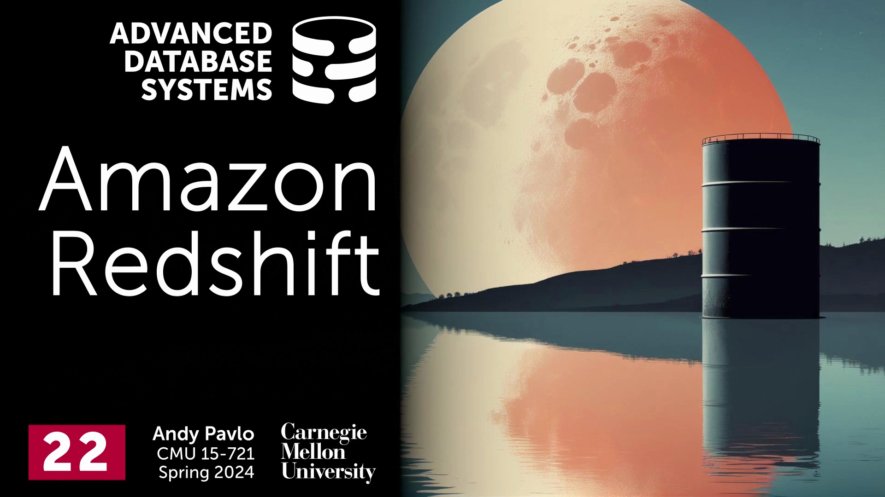
卡内基梅隆大学《高级数据库系统》(Advanced Database Systems) 课程正在现场录制。这是本学期的最后一讲，主题聚焦于 Amazon Redshift。由于许多现代数据库系统共享相似的基础原理，为避免内容冗余，本次讲座将着重介绍 Redshift 区别于其他同类系统的独特架构组件。尽管指定的阅读文献全面概述了该系统的各项功能，但往往缺乏具体的底层实现细节。因此，本讲座将结合公开资料中关于 Redshift 内部工作机制的信息，以弥补这一不足。
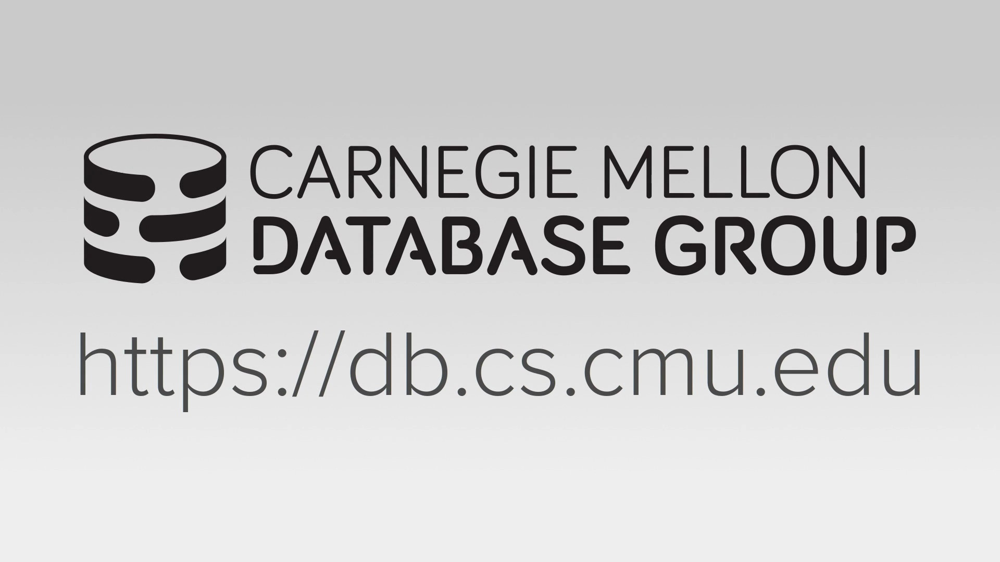

## 期末项目提交与展示网页
在深入技术内容之前，需要先说明一些课程事务安排。期末答辩定于下周四上午9点在本教室举行，学生们将就早餐选项进行投票。在提交材料方面，你需通过邮件发送演示幻灯片、期末项目报告，以及一个包含姓名与项目 GitHub 链接的指定 JSON 文件。这些 JSON 数据将用于在课程网站上自动生成公开的展示网页。该展示平台极具价值：当讲师接到招聘方咨询时，可直接引用你的项目作品；同时，它也是撰写专业推荐信的重要参考依据，这对未来需办理 H-1B 等工作签证的国际学生而言尤为关键。
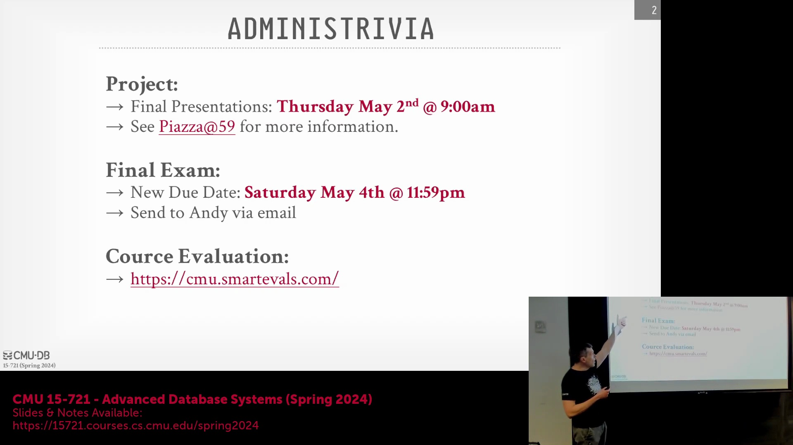

## 期末考试更新与改造作业
期末考试截止日期已调整为5月4日（周六）午夜。作出此调整是因为我们意识到，去年将考试与答辩截止日期安排在同一时间导致了不必要的流程瓶颈。考试题目已发布在 Piazza 上，要求你们对现有的数据库系统进行修改与优化。我们将提供本学期探讨过的优化技术清单，你必须从中严格选择三项。核心目标是严谨论证为何选择这些技术而非其他替代方案，并运用课程涵盖的参考文献与技术概念来支撑你的论点。

## 考试指南、性能侧重点与 AI 使用政策
这项研究生级别的作业旨在考察批判性思维与工程权衡能力。虽然没有唯一且死板的“正确答案”，但确实存在明显错误的选项。该练习要求你评估哪些优化措施能带来最高的性能投资回报率(Performance ROI)。同时，你还需考虑技术依赖关系：选择某项优化可能需以另一项为前提，从而占用多个选择名额。难度因人而异；例如，若缺乏相关经验，修改并发控制(Concurrency Control)模块将颇具挑战，而修改查询优化器(Query Optimizer)则普遍较为复杂。允许使用 ChatGPT 等 AI 工具，但必须通过 Google 表格(Google Sheets)如实申报使用程度。提交材料上限为四页，且所有论证必须严格基于课程阅读文献与讲座内容。

## 课程评估与 Yellowbrick 架构回顾
课程评估提醒邮件即将发送。回到技术内容，上节课我们讲解了 Yellowbrick，这是一个颇具特色但相对小众的系统。Yellowbrick 展示了聘请资深系统工程师所能达到的性能极限。其架构激进地绕过了操作系统(Operating System)，以消除查询执行过程中的干扰。该系统通过自定义系统调用(System Call)直接在用户空间(User Space)启动，将操作系统的角色降级为仅处理基础的日志记录与维护任务。这种方法近乎构建了一个专用的单内核数据库环境，提供了最大程度的控制权与确定性的性能表现。不过，目前尚不清楚本课程讨论的其他系统是否也采用了类似的底层驱动绕过技术。

## 分布式 PostgreSQL 与 OLAP 数据库的演进
要深入理解 Amazon Redshift，需回顾分布式 PostgreSQL 的发展脉络。Postgres 最初是20世纪80年代由加州大学伯克利分校开发的单节点系统（支持 QUEL 查询语言），后在研究生引入 SQL 支持后演变为 PostgreSQL。在20世纪90年代至2000年代，众多项目尝试将其分布式化，包括 Postgres XC、StormDB（后被 TransLattice 收购）以及 Postgres XL（自2015年左右起已基本停止维护）。像 YugabyteDB 这样的现代系统采用了混合架构，保留了 Postgres 前端，但彻底替换了底层存储引擎。与此同时，21世纪初至中期出现了向列式存储(Columnar Storage)与联机分析处理(OLAP)架构的转型。第一代专用 OLAP 数据库相继问世，包括 Greenplum、Sybase IQ 以及 Vertica。

## 亚马逊的收购策略与 Redshift 的起源
Redshift 的直接技术前身是 ParAccel。2010 年，随着 AWS 云服务取得巨大成功，亚马逊内部曾就是从零开始自研专有数据仓库(Data Warehouse)，还是直接收购现有方案展开过激烈讨论。彼时，大多数早期的 OLAP 先驱企业（如被 EMC 收购的 Greenplum、被惠普收购的 Vertica、被微软收购的 DataAllegro，以及被 Teradata 收购的 AsterData）均已悉数被科技巨头收入囊中。ParAccel 成为最后一家保持独立的厂商。亚马逊并未直接全资收购该公司，而是向其 E 轮融资(Series E)注资约 2000 万美元，从而获得了其源代码(Source Code)的使用授权。值得注意的是，其他部分被收购的系统（如 AsterData）在经历内部代码审计后，因代码质量低下被判定为无法使用而遭彻底弃用，尽管其收购成本高达 1 亿美元。亚马逊以极具成本效益的方式取得了 ParAccel 的授权，并辅以后续庞大的内部工程研发投入，最终为如今大获成功的 Amazon Redshift 服务奠定了坚实基础。

---

## 收购策略与市场发布
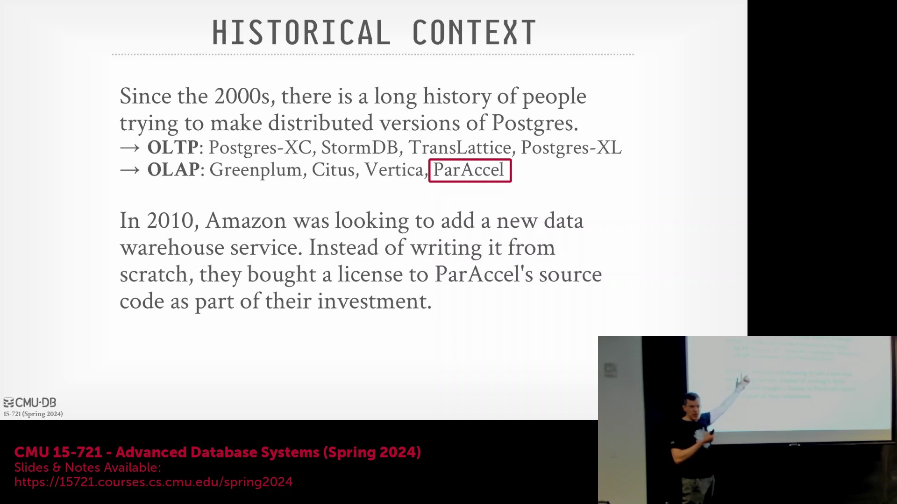
亚马逊研发 Redshift 的驱动力源于一次战略收购：以约 2000 万美元收购 ParAccel。这与竞争对手在 Vertica 或 DataAllegro 等系统上动辄耗资 1 亿美元的做法形成了鲜明对比。在获取源代码(Source Code)后，亚马逊迅速将其集成至 AWS 平台，并于 2012 年左右正式对外发布该服务。此次发布恰逢 Snowflake 崭露头角之际，由此奠定了 Redshift 作为亚马逊旗舰级联机分析处理(OLAP)数据库即服务(DBaaS)产品的市场地位。

## 架构演进与 Serverless 能力

Redshift 最初基于 ParAccel 的无共享架构(Shared-Nothing Architecture) PostgreSQL 分支构建，随后逐步演进，转向了共享磁盘架构(Shared-Disk Architecture)与存算分离架构(Disaggregated Storage Architecture)模型。2017 年，亚马逊引入了 Amazon S3 集成，随后又推出了无服务器(Serverless)部署选项。与早期 Snowflake 强制要求预先配置集群的做法不同，Redshift 的 Serverless 架构允许用户直接提交查询，无需手动管理底层基础设施，使其运营模式更贴近 Google BigQuery 原生的 Serverless 设计。

## 托管存储与自动化目标
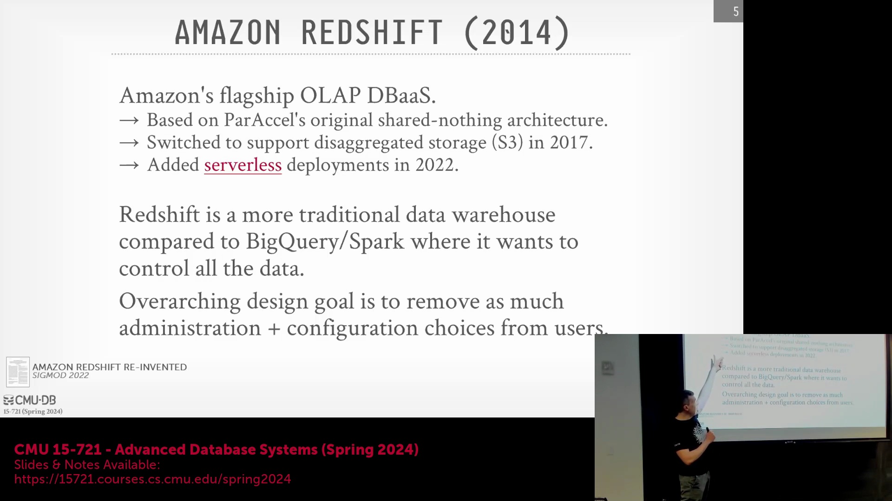
尽管在云原生(Cloud-Native)技术方面取得了长足进步，Redshift 仍保留了与 Yellowbrick 类似的传统数据仓库(Data Warehouse)理念，即通过 Redshift 托管存储(Redshift Managed Storage, RMS)优先实现集中式数据治理(Data Governance)。尽管系统支持直接查询 Amazon S3，但为获取更优的性能表现，默认策略仍是将数据导入 RMS 中。其核心设计目标在于引入机器学习(Machine Learning, ML)驱动的自动化功能，以大幅降低运维开销。相较于早期版本将复杂的 PostgreSQL 内部机制直接暴露给终端用户的做法，这是一项显著的改进。

## 亚马逊 OLAP 生态与许可协议动态

亚马逊的数据分析产品矩阵包含多项功能存在重叠的服务，这可能会使用户产生混淆。初代 Redshift 依赖于本地计算与本地存储架构，而 Amazon Athena（2016 年推出）则是基于 Presto/Trino 深度封装的版本，专为无服务器(Serverless)数据湖(Data Lake)查询场景进行优化。Redshift Spectrum（2017 年推出）则成功弥合了这两种架构范式，允许用户通过 Redshift 接口直接查询 Amazon S3 中的数据，无需预先导入。然而，亚马逊将 Presto 等开源项目(Open Source Projects)进行商业化托管的做法曾引发行业争议，促使 Elastic 等软件供应商修改开源许可证(Open Source Licenses)，旨在防止云服务商从这些开源项目中获取超越原始开发者的商业收益。

## 核心技术特性与执行引擎

现代版 Redshift 集成了基于推送模式(Push-Based)的向量化查询处理技术(Vectorized Query Processing)，以及一套复杂的混合代码生成策略(Mixed Code Generation Strategy)。其独特之处在于，将预编译的向量化基础算子(Vectorized Primitives)与全局的源码到源码编译(Source-to-Source Compilation)相结合，并大量采用了由亚马逊工程师手工调优的 Intel 高级向量扩展指令集(Intel AVX2 Instructions)。该架构还通过计算节点缓存(Compute Node Cache)、专有的列式存储格式(Columnar Storage Format)、用于解析复杂查询计划的分层查询优化器(Hierarchical Query Optimizer)，以及名为 Aqua 的专用硬件加速层得到了进一步强化。

## 高层架构与存储层
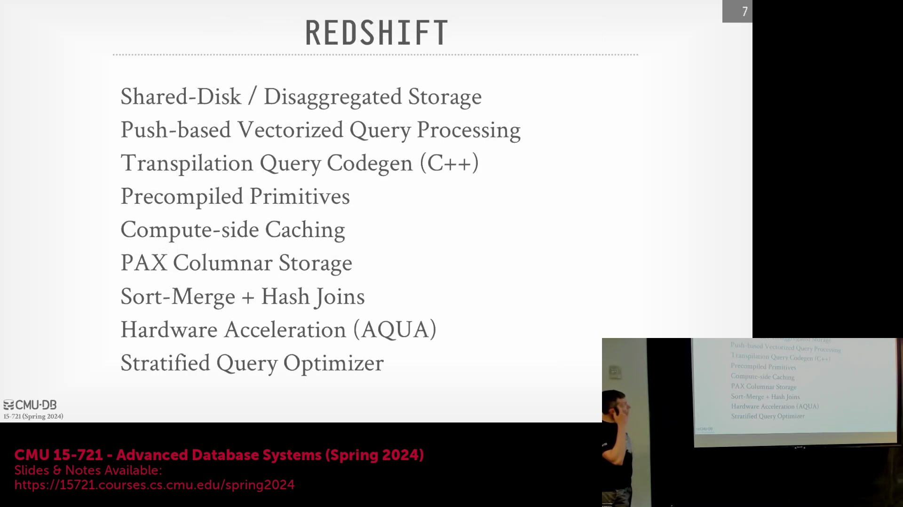
系统架构图呈现了一个多层级架构设计。底层严格区分了 Amazon S3 对象存储(S3 Object Storage)与 Redshift 托管存储(RMS)，其中 RMS 运行于配备本地直连存储(Local Direct-Attached Storage)的 Amazon EC2 实例(Elastic Compute Cloud Instances)之上。这些节点能够智能管理数据分层与溢出，并实现与 S3 之间无缝的读写交互。Redshift Spectrum 组件支持直接访问外部数据，而 Aqua 加速层则被战略性地部署于计算节点与 RMS 之间，专门用于卸载计算密集型任务(Compute-Intensive Workloads)。

## 向量化处理与代码生成
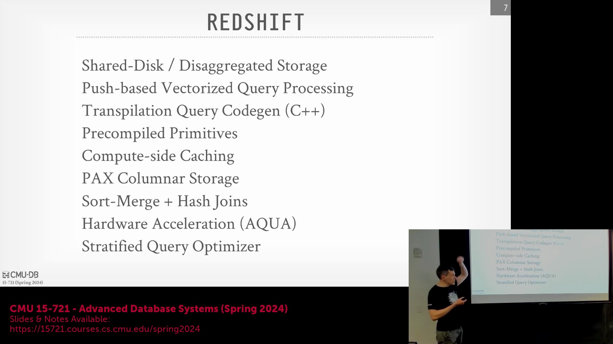
Redshift 的执行引擎利用先进的编译技术以最大化 CPU 利用率。通过将向量化执行模型(Vectorized Execution Model)与全查询编译(Full Query Compilation)技术深度融合，该系统有效最小化了中间解释器开销(Interpreter Overhead)与数据搬运成本(Data Movement Overhead)。这种双重技术路径结合分层优化器(Hierarchical Optimizer)，使 Redshift 能够动态重写并加速常规分析工作负载(Analytical Workloads)以及复杂的即席查询(Ad-Hoc Queries)，且全程无需人工干预调优。

## 计算资源配置与查询编译
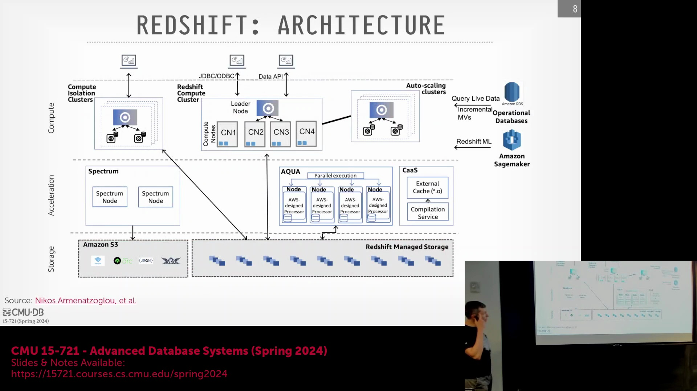
Redshift 的计算层专为无状态横向扩展(Stateless Horizontal Scaling)而设计。在业务需求高峰期，系统会自动弹性配置额外的工作节点(Worker Nodes)，并利用本地 SSD 进行高速缓存。集中式编译服务(Centralized Compilation Service)会动态调用 GCC 编译器，将 SQL 查询实时翻译为高度优化的原生可执行二进制文件(Native Executable Binaries)。当用户选择“托管存储”(Managed Storage)实例类型时，底层节点会自动在本地磁盘、RMS 逻辑层与 Amazon S3 存储桶之间智能路由数据访问路径。这一机制有效屏蔽了底层基础设施的复杂性，为用户提供了无缝且完全托管的全链路查询体验。
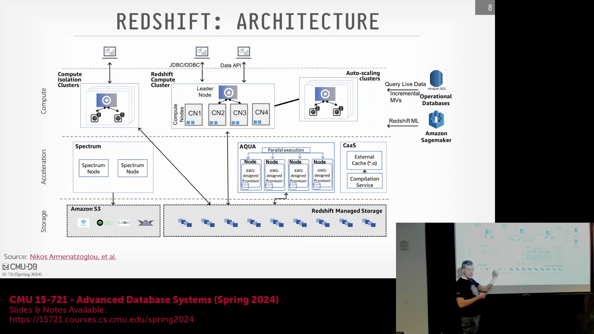
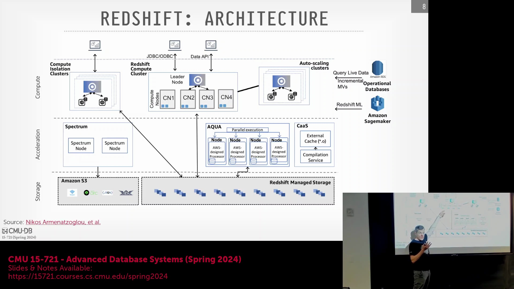

---

## 托管存储架构与 S3 集成
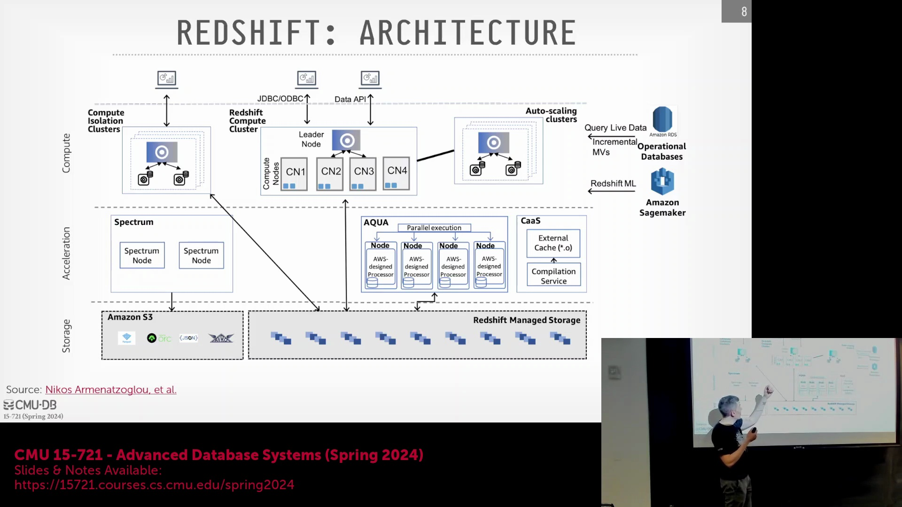
Redshift 托管存储(Redshift Managed Storage, RMS)的底层架构依赖于计算实例(Compute Instances)与专用存储节点之间的紧密集成。RMS 并未采用传统的单体架构(Monolithic Architecture)，而是实质上构建于标准 Amazon S3 基础设施之上，并叠加了专有的管理层软件。在配置计算集群(Compute Clusters)时，系统会动态预配这些增强型 S3 后端实例，使计算节点能够与存储层无缝通信，同时保留了对象存储(Object Storage)固有的高扩展性与数据持久性。

## 基于推送的执行模型与向量化原语

Redshift 的查询引擎(Query Engine)采用基于推送(Push-Based)的执行模型，明确摒弃了基于拉取(Pull-Based)的迭代器范式，旨在最小化状态管理开销并防止 CPU 寄存器(CPU Registers)溢出。为缓解即时编译(Just-In-Time Compilation, JIT)带来的启动延迟，系统高度依赖预编译且经手工优化的向量化基础算子(Vectorized Primitives)来执行表扫描(Table Scan)与数据过滤(Data Filtering)等基础操作。亚马逊工程师并未依赖编译器(Compiler)的自动向量化(Auto-Vectorization)功能，而是直接调用底层 CPU 内部指令(CPU Intrinsics)手工编写这些算子，从而确保在各类工作负载(Workloads)下实现最大程度的指令级并行(Instruction-Level Parallelism)与可预测的性能表现。

## 管道管理与软件预取

为防止数据处理过程中的 CPU 流水线停顿(Pipeline Stalls)，Redshift 实现了一套复杂的“宽松算子融合”(Relaxed Operator Fusion)技术，并辅以柔性流水线断点(Soft Pipeline Breakers)。数据流通过环形缓冲区(Ring Buffer)进行中转，在进入下一处理阶段前临时缓存向量化数据批次(Vectorized Data Batches)。在此类受控循环(Controlled Loops)中，编译器会精准注入软件预取指令(Software Prefetch Instructions)。系统通过精确计算访问特定内存地址(Memory Address)前所需的指令周期数，确保下一批数据恰好准时抵达 CPU 缓存(CPU Cache)。该机制既避免了内存延迟访问导致的缓存未命中(Cache Misses)，又有效防止了过早预取引发的流水线气泡(Pipeline Bubbles)。

## 运行时自适应与连接优化
尽管其自适应执行(Adaptive Execution)策略不如 BigQuery 或 Snowflake 等竞品激进，Redshift 仍深度集成了多项针对性的运行时优化(Runtime Optimizations)。系统会根据数据特征动态切换字符串操作(String Operations)的向量化实现路径，例如采用 ASCII 与 Unicode 的优雅回退(Fallback)策略。在执行哈希连接(Hash Joins)时，系统利用旁路信息传递(Sideways Information Passing, SIP)机制实时监控哈希链(Hash Chains)的规模。若检测到哈希链面临溢出至磁盘(Disk Spill)的风险，Redshift 会自动动态扩容配套的布隆过滤器(Bloom Filters)。此自适应调整有效降低了哈希过滤的误判率(False Positive Rate)，最大限度减少了不必要的磁盘 I/O 操作，且无需重构全局查询计划(Query Plan)即可维持高效的连接执行。

## 分布式编译服务与全局缓存
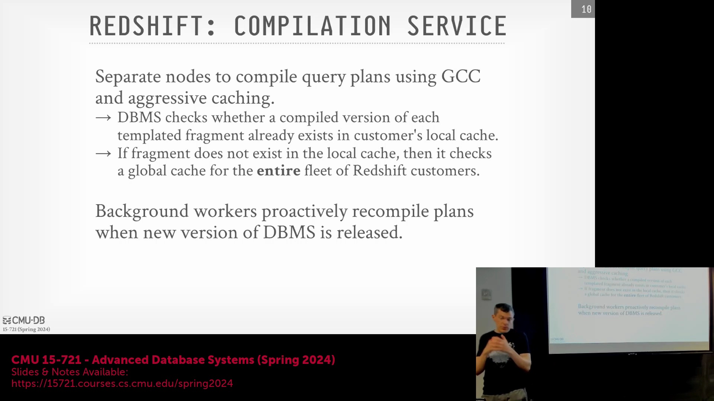
与 Yellowbrick 的架构设计理念类似，Redshift 将查询编译(Query Compilation)任务从工作节点(Worker Nodes)卸载至专用的集中式编译服务(Centralized Compilation Service)。该服务调用 GCC 编译器生成高度优化的原生机器码(Native Machine Code)。为彻底消除编译延迟(Compilation Latency)，Redshift 引入了多级缓存(Multi-Level Caching)策略。首先，本地缓存(Local Cache)会保留近期编译生成的查询代码片段(Code Fragments)。若发生本地缓存未命中(Cache Miss)，系统将向覆盖整个集群规模的全局代码缓存(Global Code Cache)发起查询。由于编译后的二进制代码仅封装通用的逻辑操作（如针对特定列类型(Column Types)的过滤谓词(Filter Predicates)），并不包含任何用户数据(User Data)，因此可在多租户环境(Multi-Tenant Environment)中安全共享，无数据泄露风险。
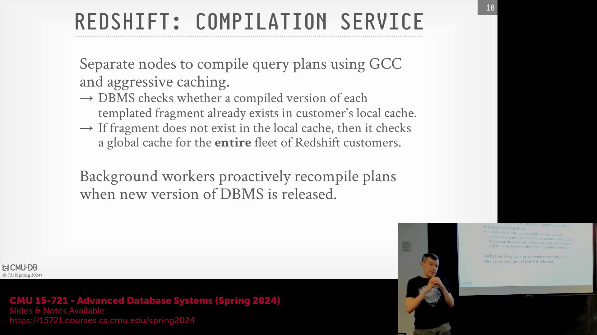
该全局缓存机制在全集群范围内实现了高达 99.95% 的惊人缓存命中率(Cache Hit Rate)。即便集群接收到全新的查询语句，仍有 87% 的概率能在全局代码库中匹配到结构高度相似的预编译二进制文件(Pre-compiled Binaries)。此举有效根治了传统 JIT 系统长期存在的编译开销(Compilation Overhead)痛点，将查询延迟从数秒骤降至仅需缓存查找的亚毫秒级微小延迟。

## 云原生缓存优势与成本效益

Redshift 全局编译缓存(Global Compilation Cache)的成功，直接归功于其云原生(Cloud-Native)与多租户(Multi-Tenant)架构设计。在传统本地部署(On-Premises)数据库中，受限于安全与隔离(Security and Isolation)要求，跨租户代码共享根本无法实现。依托全托管服务(Fully-Managed Service)模式，亚马逊得以汇聚全球用户的查询特征与计算洞察，构建出一个庞大且共享的优化查询二进制代码库。通过网络直接拉取这些预编译对象(Pre-compiled Objects)，其速度远快于在本地执行 GCC 编译，且显著降低了 CPU 资源消耗（本地编译复杂的分析查询(Analytical Queries)往往耗时数秒）。该实践精准契合了“编译即服务”(Compilation-as-a-Service)的新兴技术趋势，其理念类似于 Azul Systems 的 JVM 优化模型，充分展现了云基础设施如何将传统理论上的编译器开销转化为高度优化的分布式计算资源(Distributed Computing Resources)。

---

## 预编译原语与编译效率

为避免对每个查询代码片段执行完整的即时编译(Just-In-Time Compilation, JIT)，Redshift 刻意依赖精心优化的预编译基础算子(Pre-compiled Primitives)来处理表扫描(Table Scan)与数据过滤(Data Filtering)等底层操作。尽管运行时函数调用会带来 CPU 跳转与调用开销(CPU Jump/Call Overhead)，但向量化执行(Vectorized Execution)通过批量处理(Batch Processing)有效分摊了该成本，使其影响微乎其微。在亚马逊庞大的业务规模下，即使是对微小且重复的代码片段进行反复编译，累积起来也会造成巨大的计算资源浪费。亚马逊利用全系统遥测数据(System-wide Telemetry)与性能指标精准定位这些低效环节，并设计了一套专用缓存策略(Caching Strategy)，大幅降低了编译开销(Compilation Overhead)。此举不仅为客户提供了更低的查询延迟(Query Latency)，还为平台节省了数百万美元的基础设施成本(Infrastructure Costs)。
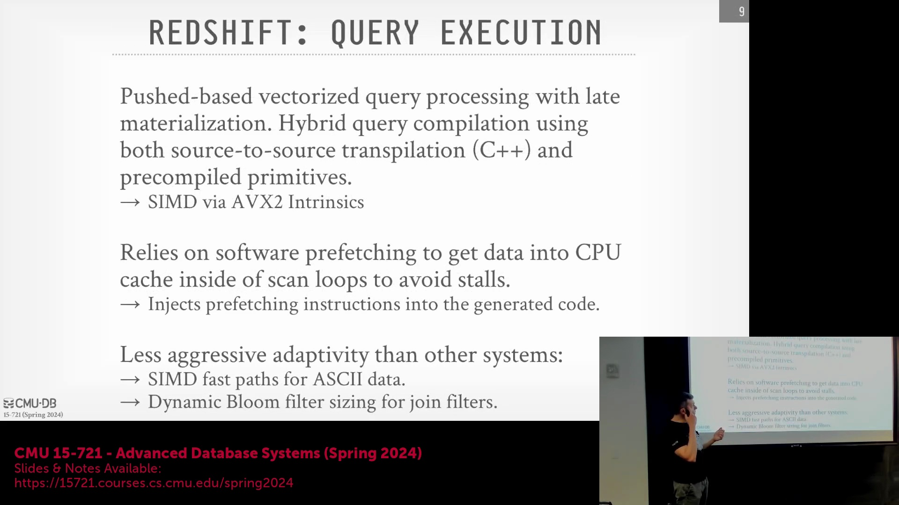

## 多版本缓存与硬件感知编译
为最大化预编译代码的利用率，Redshift 维护了一个精密的全局代码存储库(Global Code Repository)，其中同时保存了初始生成的源代码(Source Code)与多个已编译的机器码二进制文件(Machine Code Binaries)。鉴于 AWS 持续迭代推出新的实例类型(Instance Types)与底层 CPU 架构(Underlying CPU Architectures)，后台工作进程(Background Worker Processes)会自动检索缓存的源代码片段，并针对最新的硬件平台与 Redshift 软件版本进行重新编译(Recompilation)。这确保了在查询路由(Query Routing)阶段，系统能够精准匹配并调度专为当前执行硬件定制优化的二进制文件。这种云原生(Cloud-Native)能力使亚马逊能够在异构服务器集群(Heterogeneous Server Clusters)中持续维持峰值性能(Peak Performance)，同时免除了客户管理硬件相关编译状态(Hardware-Specific Compilation State)的负担。

## Aqua：基于 FPGA 的硬件加速
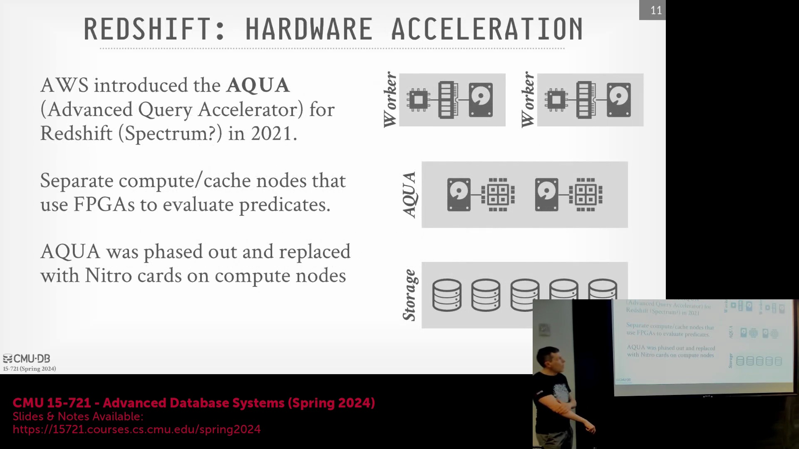
Aqua（高级查询加速器，Advanced Query Accelerator）于 2021 年左右正式推出，是一个专用的硬件加速层(Hardware Acceleration Layer)，架构上部署于计算工作节点(Compute Worker Nodes)与存储层(Storage Layer)之间。依托现场可编程门阵列(Field-Programmable Gate Array, FPGA)技术，Aqua 实现了深度的谓词下推(Predicate Pushdown)与聚合下推(Aggregation Pushdown)，使原始数据检索、条件过滤及初步聚合计算能够在数据返回至计算节点前高效完成。尤为关键的是，Aqua 作为全局多租户服务(Global Multi-Tenant Service)独立运行，与任何特定的 Redshift 集群解耦。这种架构分离(Architectural Decoupling)使用户能够弹性伸缩或调整计算节点规格，而无需担忧数据重分布(Data Redistribution)引发的性能瓶颈，因为该加速层在整个集群拓扑中始终保持全局可用。

## 向 Nitro 演进与存储层集成
尽管初期备受业界瞩目，Aqua 仍在 2022 年左右被悄然下线，且未发布正式的公开弃用公告(Public Deprecation Notice)。亚马逊将其核心的计算下推(Compute Pushdown)能力直接深度集成至 AWS Nitro 系统(AWS Nitro System)的定制芯片(Custom Silicon)与存储层基础设施(Storage Infrastructure)中。通过将硬件加速逻辑(Hardware Acceleration Logic)嵌入底层虚拟机监控程序(Hypervisor)及专用的网络与存储控制器卡(Dedicated Network and Storage Controller Cards)中，亚马逊彻底消除了对独立 FPGA 加速服务的依赖。该演进路径与 Amazon S3 Select 的设计理念一脉相承，即数据过滤与计算操作直接在对象存储层(Object Storage Layer)内部原生执行(Native Execution)，从而在保持甚至进一步提升下推性能(Pushdown Performance)的同时，大幅简化了整体系统架构。

## 查询优化器与统计信息管理

Redshift 的查询优化器(Query Optimizer)在底层架构上仍深度沿袭 PostgreSQL 的设计范式，首先应用启发式规则(Heuristic Rules)执行初始逻辑重写(Logical Rewriting)，随后通过基于成本的搜索算法(Cost-Based Search)确定最优的连接顺序(Join Ordering)。针对存储于 Redshift 托管存储(Redshift Managed Storage, RMS)中的数据，系统会自动化执行 `ANALYZE` 命令以采集详尽的列级统计信息(Column-Level Statistics)，并构建直接输入至基于成本的优化器(Cost-Based Optimizer)的统计模型(Statistical Models)。相对而言，针对直接查询原始 Amazon S3 数据的 Redshift Spectrum 查询，系统缺乏深度的表级统计信息(Table-Level Statistics)。为此，Redshift 转而采用从 Apache Parquet 文件头(Apache Parquet File Headers)中动态提取元数据(Metadata)的策略，并在计算层缓存区域映射(Zone Maps，即记录列的最小值与最大值范围)。该机制实现了高效的过滤器下推(Filter Pushdown)，有效规避了不必要的全文件扫描(Full File Scans)。

---

## 查询重写框架与优化器扩展

Redshift 的相关论文大量强调了其内部的查询重写框架(Query Rewriting Framework, QRF)，尽管关于其具体实现的公开文档仍然较为有限。该框架基于领域特定语言(Domain-Specific Language, DSL)构建，开发人员可通过该语言定义模式匹配规则(Pattern Matching Rules)及相应的查询转换逻辑(Query Transformation Logic)。该框架旨在实现敏捷迭代与快速扩展，据团队透露，新入职的工程师或实习生仅需三天即可完成一项功能变更的开发与集成。这一设计思路与 Yellowbrick 的优化器策略高度一致：Redshift 并未对基于成本的优化器(Cost-Based Optimizer, CBO)的核心搜索与枚举算法(Search and Enumeration Algorithms)进行彻底重构，而是采用针对性、定制化的重写规则(Rewrite Rules)对传入查询进行修补与转换，从而将其高效引导至高度优化的执行计划(Execution Plans)。

## 混合存储的最佳实践与统计信息管理
亚马逊提供了详尽的官方文档(Official Documentation)，详细指导如何优化查询性能，尤其是在处理缺乏原生表级统计信息(Table-Level Statistics)的 Redshift Spectrum 数据时。业界推荐的最佳实践是将大型事实表(Fact Tables)存放在 Amazon S3 中，而将较小的维度表(Dimension Tables)存储在 Redshift 托管存储(Redshift Managed Storage, RMS)内。这种混合存储布局(Hybrid Storage Layout)使优化器能够采集并利用维度表的精确统计信息，从而实现高效的星型模式查询识别(Star Schema Query Recognition)：系统可为维度表构建内存哈希表(In-Memory Hash Table)，并针对基于 S3 的事实表执行流式扫描探测(Streaming Probe)。此外，用户也可手动为外部 Amazon S3 表定义统计信息(Statistics)。配置生效后，亚马逊会自动扫描底层原始数据，采集数据分布指标(Data Distribution Metrics)并进行内部缓存，从而显著提升基数估计(Cardinality Estimation)与连接顺序优化(Join Ordering Optimization)的准确性。

## 托管存储、Spectrum 与专有压缩
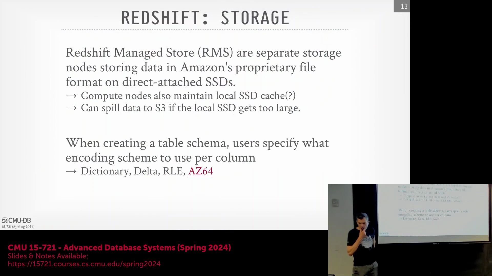
RMS 与 Spectrum 在架构层面的核心差异在于数据格式(Data Format)与存储管理策略。RMS 采用专有的列式存储格式(Proprietary Columnar Storage Format)，由配备本地直连固态硬盘(Local Direct-Attached SSDs)的计算节点提供底层支持，并具备将冷数据或溢出数据自动分层转储至 S3(Automatic Tiering to S3)的能力。相比之下，Spectrum 支持免转换直接读取原生开放格式数据(Native Open-Format Data)，如 Parquet、CSV 和 JSON。尽管两者采用独立的计费模型(Billing Models)与配置范式，但最终均会将查询执行(Query Execution)路由至相同的底层计算工作节点(Compute Worker Nodes)。为最大化 I/O 效率，亚马逊对存储技术栈(Storage Stack)实施严格控制，提供多种数据编码(Encoding)与压缩方案(Compression Schemes)。其中一项核心特性是 AZ64，这是亚马逊内部自主研发的专有压缩编解码器(Compression Codec)，其压缩率与 Snappy 算法相当，但解压速度显著更快。官方有意省略了公开的技术实现细节，这符合企业级的知识产权保护策略(Intellectual Property Protection Strategy)，同时也呼应了学术界建议研究人员避免逆向工程或审查专有黑盒系统的惯例。

## 基准测试分析与相对性能宣称

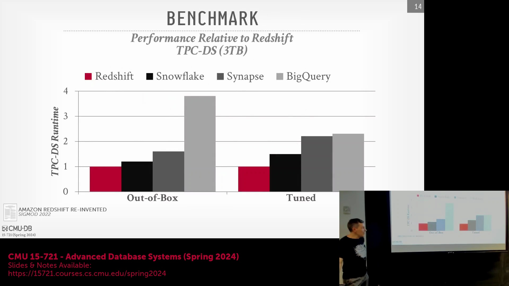
该论文收录了一项基于 3TB TPC-DS 基准测试(TPC-DS Benchmark)的性能评估报告，重点对比了开箱即用(Out-of-the-Box)默认配置与深度调优(Tuned)配置下的表现差异。调优基线(Tuned Baseline)涵盖了自定义排序键(Sort Keys)、数据分布策略(Distribution Styles)以及优化的压缩编码(Compression Encodings)，实验结果展现出相较于默认设置的显著性能跃升。值得注意的是，图表中的性能指标均以相对于 Redshift 的相对性能倍数(Relative Performance Multipliers)呈现，而非绝对执行时间(Absolute Execution Time)。这是云计算行业的通用规范，旨在规避潜在的法律合规风险，并防止竞争对手在营销宣传中将基准测试数据武器化(Weaponization of Benchmark Data)。尽管 Redshift 正朝着无服务器自动化(Serverless Automation)与零运维调优(Zero-Touch Tuning)方向演进，但实验数据清晰表明，针对系统架构与参数配置进行手动调优(Manual Tuning)依然能带来不可忽视的性能红利。

## 实际采用与企业决策
在评估云厂商基准测试时，绝对性能数值往往不如配置透明度(Configuration Transparency)更具参考价值。在真实的企业级采购环境中，选择云数据仓库(Cloud Data Warehouse)的决策极少仅由公开的性能图表决定。相反，决策过程在很大程度上受数据驻留位置(Data Residency)的制约；对于已在 Amazon S3 上沉淀 PB 级历史数据的组织，技术团队自然会优先倾斜于 Redshift 或 Spectrum，以规避高昂的数据迁移成本(Data Migration Costs)与出站流量费用(Egress Fees)。针对大规模生产环境部署，企业通常会启动正式的概念验证(Proof of Concept, POC)流程，并由云服务商的解决方案架构师(Solutions Architects)提供全程支持。这些架构师会协助迁移代表性业务负载(Representative Workloads)，执行受控的对比测试(Controlled Comparative Tests)，并协助敲定多年期预付费承诺合同(Multi-Year Commitment Agreements)。因此，专业的基准测试评估能力应侧重于深入理解架构配置权衡(Configuration Trade-offs)与系统集成成本，而非盲目采信经过归一化处理(Normalized)的性能宣传。

---

## 解读厂商基准测试与核心引擎趋同
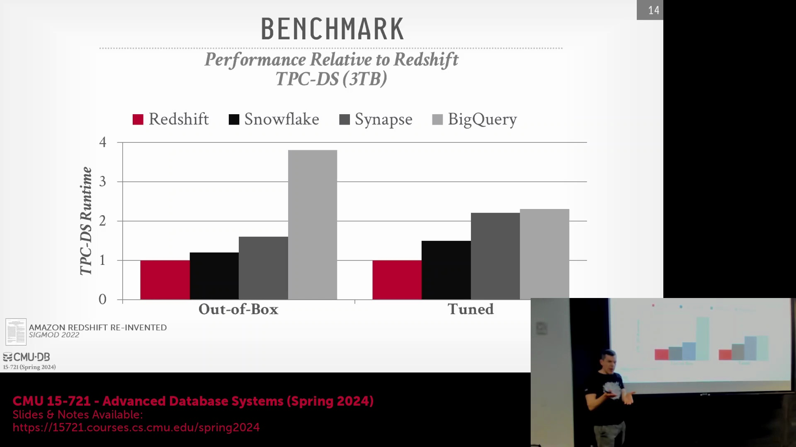
对于云厂商发布的技术论文中的性能评估报告，应保持合理的审慎态度。厂商极易通过注入专门针对基准测试负载(Benchmark Workloads)定制的查询重写规则或优化手段来进行基准测试调优(Benchmark Tuning)。因此，企业架构师极少仅凭这些相对性能图表就做出数百万美元的基础设施采购决策。事实上，现代联机分析处理(OLAP)平台在底层执行引擎(Execution Engine)技术上已高度趋同。几乎所有主流云数据仓库(Cloud Data Warehouses)如今均采用基于推送模式(Push-Based)的向量化处理(Vectorized Processing)，将预编译基础算子(Pre-compiled Primitives)与全局即时编译(Global Just-In-Time Compilation, JIT)相结合，并辅以精细的多级缓存策略。Redshift 的独特之处在于其深度融合了向量化算子与全查询代码生成(Full Query Code Generation)技术。鉴于各厂商核心引擎的性能现已旗鼓相当，系统选型最终往往更侧重于架构简洁性、生态系统集成度(Ecosystem Integration)与运维便利性，而非单纯的基准测试性能倍数。
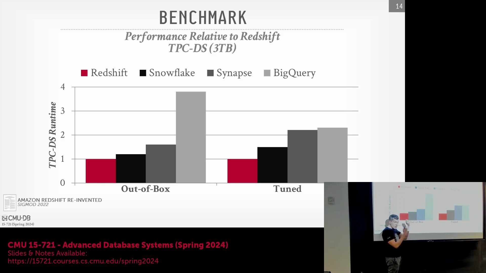

## 市场定位与创新者的窘境
面对亚马逊、谷歌和微软等资源雄厚的云服务商巨头(Cloud Hyperscalers)，Snowflake 之所以能取得卓越的商业成功，很大程度上归功于其精准的市场定位与架构创新。2012 年亚马逊推出 Redshift 时，本质上是对 ParAccel 系统的封装与重构，秉持着“快速上线、持续迭代”的云服务演进策略。相比之下，Snowflake 虽入场稍晚，但率先引入了更为成熟的云原生存算分离架构(Native Disaggregated Storage and Compute Architecture)。与此同时，Oracle 和 Teradata 等传统本地部署(On-Premises)巨头则陷入了典型的“创新者的窘境”(The Innovator's Dilemma)。由于传统软件授权许可(Traditional Software Licensing)带来了庞大且稳定的现金流，这些厂商缺乏在早期果断向云原生(Cloud-Native)模式转型的内部驱动力。这种战略迟疑使得敏捷的初创企业得以在科技巨头全面调动工程资源前抢占市场份额，并成功树立起新一代行业标准。

## 同质化、UX 差异化与实时 OLAP
当前，分析型数据库(Analytical Databases)的底层执行引擎已呈现高度同质化趋势。Apache Velox 与 Apache DataFusion 等开源查询框架(Open-Source Query Frameworks)现已能够开箱即用地提供生产级的高性能执行层(Production-Grade Execution Layer)，大幅降低了构建新型分析系统的技术门槛。随着核心查询性能成为行业基准线，市场竞争焦点已全面转向非功能性维度(Non-Functional Dimensions)：包括用户体验的打磨、查询优化器的鲁棒性(Query Optimizer Robustness)，以及能够免除人工干预的无缝数据湖集成能力(Data Lake Integration)。与此同时，一类新兴的“实时联机分析处理”(Real-Time OLAP)系统（如 Rockset、Apache Pinot、Materialize）正迅速崛起，旨在弥合传统数据仓库在数据写入(Data Ingestion)至可查询(Data Availability)之间的延迟鸿沟。依托密集索引策略(Dense Indexing Strategies)或数据摄入时自动维护物化视图(Automatic Materialized View Maintenance upon Ingestion)等技术，这些平台能够对最新流入的数据实现近实时查询(Near-Real-Time Querying)。为维持市场竞争力，传统云数据仓库也正积极吸收并集成这一技术特性。

## 遥测驱动开发与有机架构演进
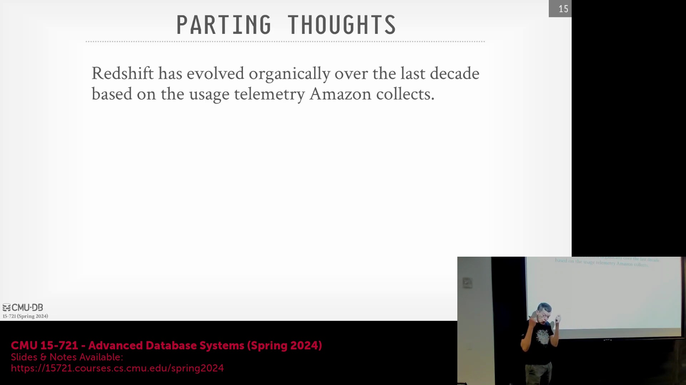
Redshift 的系统架构呈现出典型的有机演进(Organic Evolution)与数据驱动开发(Data-Driven Development)特征，而非僵化的自上而下设计(Top-Down Design)。作为全托管云服务(Fully-Managed Cloud Service)，其具备一项关键优势：能够采集覆盖全集群、针对每一次查询执行的完整遥测数据(Comprehensive Telemetry Data)。通过持续分析这些生产运维数据(Production Telemetry)，亚马逊工程师能够精准定位实际业务场景中的性能瓶颈(Performance Bottlenecks)，并优先推进那些对客户工作负载(Customer Workloads)与基础设施成本(Infrastructure Costs)产生直接影响的优化任务。例如，遥测数据曾揭示系统中存在大量执行缓慢的 `UPDATE` 操作，这在传统以读为主(Read-Optimized)的 OLAP 系统中较为罕见，该发现直接催生了针对存储层的专项优化(Storage Layer Optimizations)，从而大幅提升了数据写入性能。同理，全局编译缓存(Global Compilation Cache)与 Aqua 现场可编程门阵列(Aqua FPGA)加速层等技术创新，亦非实验性的附加功能；它们均是针对已识别瓶颈所做出的直接且经过精确成本效益测算的架构响应(Architectural Responses)。这充分印证了云规模可观测性(Cloud-Scale Observability)如何有效驱动精准的架构迭代。
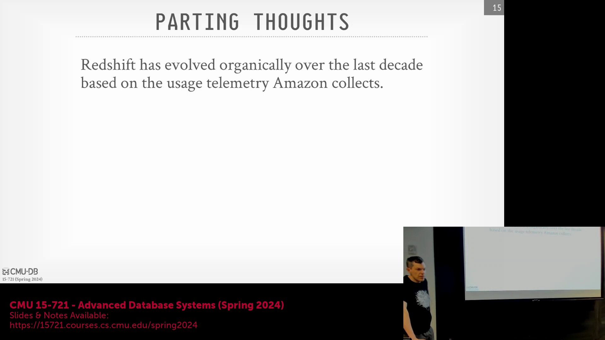

## 基准测试复杂性与商业成功

在基准测试标准(Benchmark Standards)的选型上，学术界与工业界之间存在显著分歧。学术界普遍偏爱 TPC-H 基准测试，主要因其实现门槛较低：该测试仅包含 22 条标准查询，在实验原型系统中复现相对简便。相比之下，商业厂商则统一采用 TPC-DS 标准，该标准涵盖 100 条高度复杂的查询语句，广泛涉及公共表表达式(Common Table Expressions, CTEs)、窗口函数(Window Functions)以及复杂的查询去关联(Query Decorrelation)操作。成功通过 TPC-DS 认证要求查询优化器具备极高的成熟度，这大幅抬高了学术研究型系统的实现门槛。尽管业界后续推出了 TPC-E 等较新的事务处理型基准测试以替代旧标准，但其极度复杂的配置要求与高昂的部署成本，严重制约了其在学术与工业界的广泛普及。归根结底，尽管厂商基准测试报告不可避免地带有营销倾向性(Marketing Bias)，但 Redshift 凭借持续受遥测数据指引的优化迭代(Optimization Iterations)以及云原生的弹性扩展能力(Elastic Scalability)，已稳固确立了其作为 AWS 核心数据基础服务的市场地位，并持续创造着数十亿美元的年度商业营收。
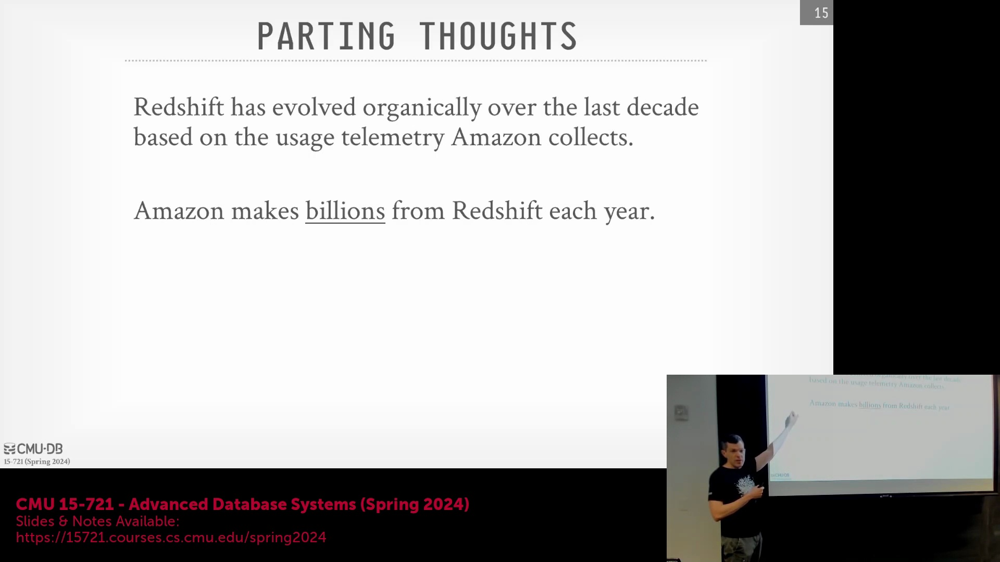

---

## 财务主导地位与 ParAccel 的遗产

亚马逊 Redshift 已成为 AWS 巨大的创收引擎(Revenue-Generating Engine)，行业估计其所属的 AWS 云业务年收入规模已突破 1000 亿美元。从历史数据来看，Redshift 曾长期位居 AWS 增长最快服务(Fastest-Growing Service)之列，直至最终被 Amazon Aurora 超越。这一商业成功充分凸显了亚马逊战略性收购(Strategic Acquisition)的深远价值。2013 年，亚马逊以约 2000 万美元的价格获得了 ParAccel 的源代码(Source Code)使用授权。尽管 ParAccel 随后被 Actian 公司收购并更名为 Actian Matrix，最终于 2016 年停止维护服务(End of Service)，但亚马逊内部工程团队成功将这笔相对微薄的授权费(Licensing Fee)转化为了每年数十亿美元的持续性利润流(Profit Stream)。尽管该服务的构建与横向扩展需要投入庞大的硬件与人力资源，但亚马逊的这一战略决策成功将一款相对小众的数据库产品转型为极具盈利能力的高价值云服务(Cloud Service)。

## Actian 的企业演进与传统数据库战略
最终收购 ParAccel 的 Actian 公司拥有一段悠久且错综复杂的发展史，其技术根源可追溯至早期关系型数据库(Relational Database)时代的 Ingres 项目，该项目所属实体曾于 20 世纪 80 年代成功上市。在随后的数十年间，Ingres 历经 Computer Associates 的收购与多次企业重组，最终在一家总部位于印度的新控股公司(Holding Company)旗下以 Actian 的品牌实现重生。Actian 的核心商业模式主要围绕收购已进入纯维护模式(Maintenance Mode)的传统数据库系统（如 VectorWise 和 Pervasive）展开，旨在通过向现有企业客户收取持续的软件支持与维护费用(Maintenance Fees)来获取稳定现金流。在被市场边缘化之前，ParAccel 也经历了完全相同的生命周期轨迹。这一对比深刻揭示了传统软件维护盈利模式与亚马逊激进且彻底的云原生商业化战略(Cloud-Native Commercialization Strategy)之间的本质差异，而正是后者为 Redshift 的蓬勃发展注入了强劲动力。

## 学期总结与期末答辩安排
随着本学期步入尾声，讲师对同学们的积极参与和投入表示衷心感谢，并提及整个学期仅有一名学生因不可抗力因素办理了退课手续(Course Withdrawal)。期末项目答辩(Project Defense)定于下周四举行，为确保评审公平性，汇报顺序将采用随机抽签方式(Randomized Order)产生。将 Redshift 安排在课程压轴环节进行讲解，并非认定其为绝对意义上的最优系统，而是因为其系统架构(System Architecture)与功能集(Feature Set)能够有效地回顾并串联本学期探讨的诸多核心数据库优化概念(Core Database Optimization Concepts)。因此，Redshift 堪称本课程最理想的综合性案例研究(Comprehensive Case Study)素材。

## 期末考试详情与结语

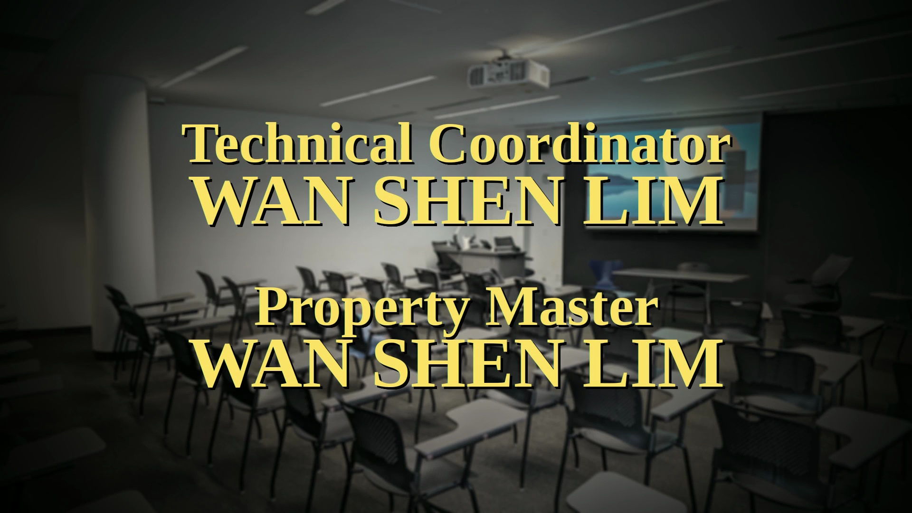

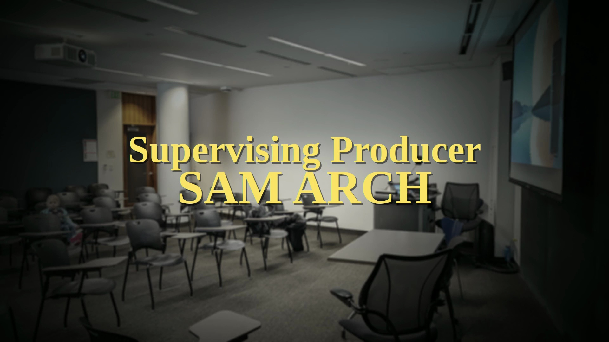

鉴于讲师近期将外出行程，本学期剩余阶段的常规答疑时间(Office Hours)将临时取消。鼓励同学们利用周末时间通过电子邮件进行一对一沟通(One-on-One Communication)，或就即将开展的项目答辩申请个性化反馈(Individualized Feedback)。期末考试试题(Final Exam Prompts)与详细指南已正式发布至 Piazza 平台，如有任何疑问或需澄清的事项，请统一在该课程帖子的讨论区(Forum Thread)内回复提问。最后，讲师预祝大家在接下来的期末考试(Final Examinations)中取得优异成绩，并正式宣布卡内基梅隆大学《高级数据库系统》(Advanced Database Systems)本学期课程圆满结课。